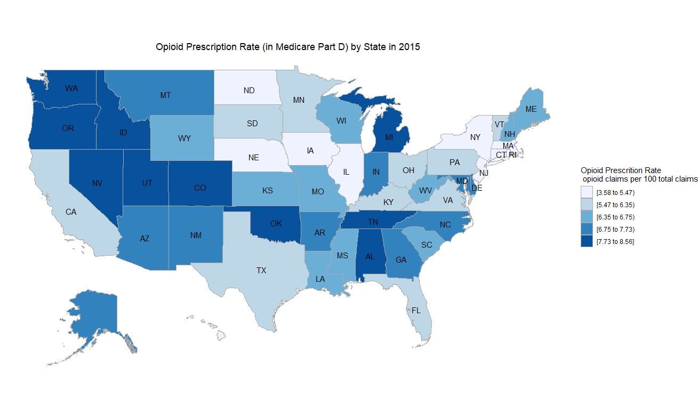
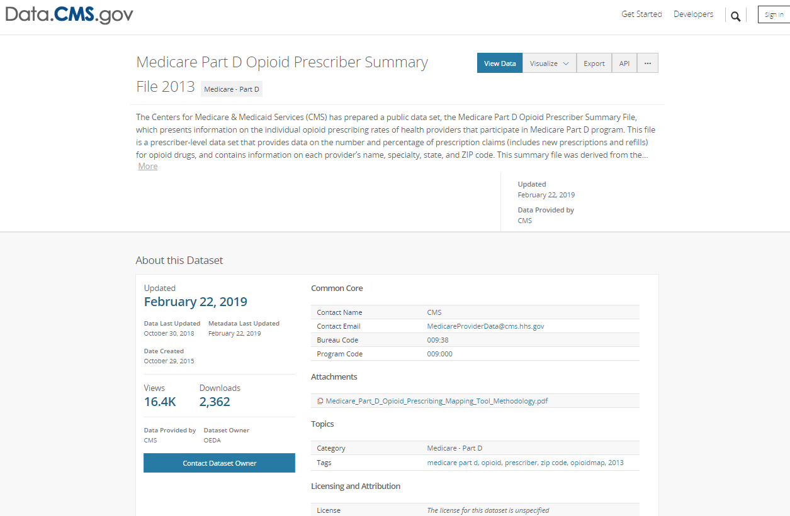
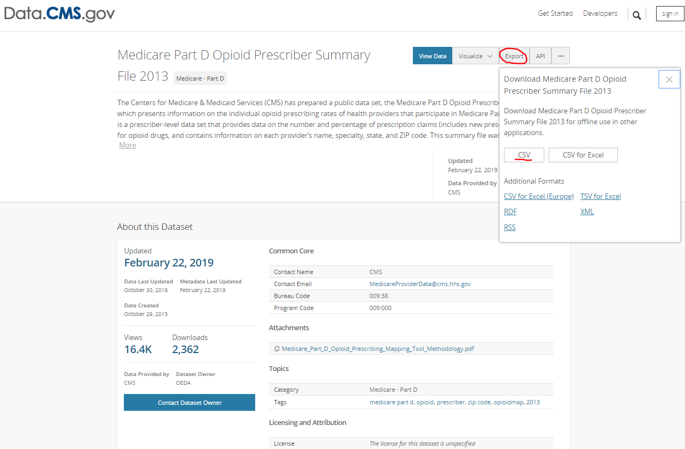
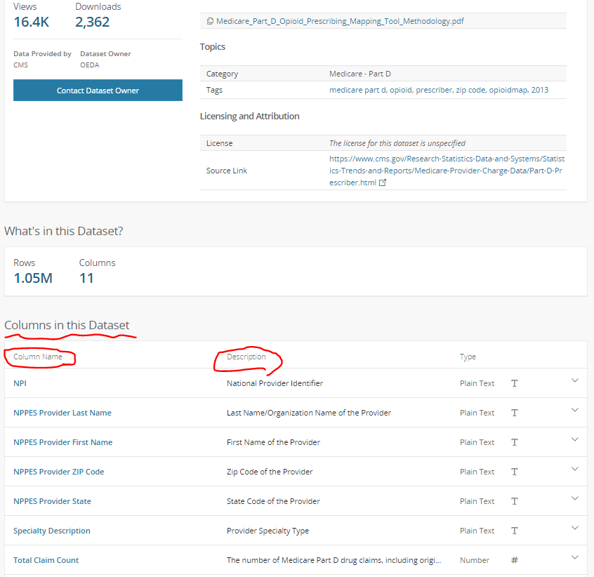

```{r setup, include=FALSE}
knitr::opts_chunk$set(include = TRUE, comment = NA,  
                      message = FALSE, warning = FALSE, echo = TRUE)
```
     
```{r echo=FALSE, out.width='100%'}

```
     
# Motivation  

Opioid prescription has become a popular topic because of 
the increasing prescription and concerns about overdose, 
opioid-related deaths, and other opioid-associated side 
effects. (Ref: [Paulozzi et al. 2011](https://www.ncbi.nlm.nih.gov/pubmed/22048730), 
[Rudd et al. 2016](https://www.ncbi.nlm.nih.gov/pubmed/28033313), 
[Rudd et al. 2016](https://www.ncbi.nlm.nih.gov/pubmed/26720857), 
[Solomon et al. 2010](https://www.ncbi.nlm.nih.gov/pubmed/21149754), 
[Dunn, et al. 2010](https://www.ncbi.nlm.nih.gov/pubmed/20083827). )     
Our motivation is to understand the opioid prescription in the States 
using publicly available data. Thus, the main questions we are going to ask 
include:  
          
(1) Among the 50 States and District of Columbia, 
which five States had the highest and lowest number in    
    (a) **Total opioid claims** ,   
    (b) **Opioid prescription rate** 
( = total opioid claims / total claims ) , and    
    (c) **Opioid prescription per 100 enrollments** ?       
        
(2) Did the total number of opioid prescriptions change over time?    
       
(3) Can you visualize the opioid prescription rate on the U.S map?   


In this case study, we'll walk you through collecting data, importing data, wrangling data, and visualizing the data, using the well-established and commonly used packages, including `kableExtra`,  `readr` , `tidyverse` , `datasets` , `ggplot2` , `scales` , `ggrepel` , `choroplethr` , and `choroplethrMaps` .     

# What is the data?      
Recently, the Centers for Medicare & Medicaid Services (CMS) has 
prepared a public dataset, including information in the part D covering 
calendar years 2013 through 2016, to make our health care system more transparent, 
and to allow citizens to understand the medical expdenditure and 
relevant health issues. 
[Medicare part D dataset](https://www.cms.gov/Research-Statistics-Data-and-Systems/Statistics-Trends-and-Reports/Medicare-Provider-Charge-Data/Downloads/Prescriber_Methods.pdf)  

```{r out.width = "95%", echo = FALSE, out.width='90%'}
#knitr::include_graphics("https://aspe.hhs.gov/system/files/images-reports-basic/70441/fig1.jpg")
```

## Medicare data (Part D)
Medicare Part D is prescription drug coverage plan 
run by Center for Medicare & Medicaid Services (CMS). 
[Here is a website describing the information about Part D](https://www.medicare.gov/drug-coverage-part-d) 
It was originally proposed by President Bill Clinton in 2000 
based on earlier proposals developed by Congresswoman 
Nancy Pelosi and Senator Tom Daschle, and started in 
January 2006. There are two ways for participants to
enroll in Medicare part D: 

1. Medicare Advantage prescription drug plans (MA-PDs), which
comes along with other Medicare benefits (ex: Part A or Part B) 
2. Stand-alone prescription drug plan (PDP)

That means that for those who have already enrolled in 
Medicare (either >= 65 years old or having certain diseases 
such as end-stage-renal-disease or other disabilities), they 
are eligible to join the Part D. 
([For more information on eligibility over 65 years old, click here](https://www.hhs.gov/answers/medicare-and-medicaid/who-is-elibible-for-medicare/index.html)
and [for Medicare eligibility for those under 65, click here](https://www.medicareinteractive.org/get-answers/medicare-basics/medicare-eligibility-overview/medicare-eligibility-for-those-under-65)). For people enrolled 
in other insurance plan, they may also be eligible to apply
for the plan. ([For more information on how Medicare works 
with other types of insurance, click here](https://www.medicare.gov/drug-coverage-part-d/how-part-d-works-with-other-insurance)). 
     

### Opioid information  
    
First, let's download the opioid prescriber data from 
the years 2013-2016, which is available from the CMS 
website as an application programming interface (API).   

To do this, you can type "opioid" in 
the [CMS website.](https://data.cms.gov/browse?q=opioid). 
The following is what you will see: 
```{r echo=FALSE, out.width='100%'}

```
    
Now you can click on the "Medicare Part D Opioid Prescriber Summary File 2013", and 
you will be directed to the next page:  
```{r echo=FALSE, out.width='100%'}

```
Further, you can click on the "Export", and choose the "csv", 
you will be guided to the download link. This is how we found 
the api link for downloading the data. The screen shot is shown 
as below:  
```{r echo=FALSE, out.width='100%'}

```
         
```{r}
if(!file.exists("./data/2016prescriber.csv")){
  file_link <- "https://data.cms.gov/api/views/6wg9-kwip/rows.csv"
  download.file(file_link,
                destfile = "./data/2016prescriber.csv",mode = "wb") 
  }


if(!file.exists("./data/2015prescriber.csv")){
  file_link <- "https://data.cms.gov/api/views/6i2k-7h8p/rows.csv"
  download.file(file_link,
                destfile = "./data/2015prescriber.csv",mode = "wb") 
  }

if(!file.exists("./data/2014prescriber.csv")){
  file_link <- "https://data.cms.gov/api/views/e4ka-3ncx/rows.csv"
  download.file(file_link,
                destfile = "./data/2014prescriber.csv",mode = "wb") 
  }

if(!file.exists("./data/2013prescriber.csv")){
  file_link <- "https://data.cms.gov/api/views/yb2j-f3fp/rows.csv"
  download.file(file_link,
                destfile = "./data/2013prescriber.csv",mode = "wb") 
}
```

There is a description about the variables. 
It can be found in the same page 
[mentioned above.](https://data.cms.gov/Medicare-Part-D/Medicare-Part-D-Opioid-Prescriber-Summary-File-201/yb2j-f3fp) 
Here is a screenshot showing how you can find the information. 
```{r echo=FALSE, out.width='100%'}

```
For your convenience, we have saved it as a csv 
file (`prescriberopioiddescription.csv`) so that you can 
understand the meanings of the variables easily. 
This file describes what data is contained in each column.
We use the `kableExtra` library to show the file
The files we just downloaded contain the following information:    
```{r}
library(kableExtra)
library(tidyverse)
partdinfodescription = read.csv("./doc2/prescriberopioiddescription.csv")
names(partdinfodescription)[1] <- "Column Name"

partdinfodescription %>%
  select(`Column Name`,Description)  %>%
  kable() %>%
  kable_styling() %>%
  column_spec(1, bold = T, border_right = T, background = "white") %>%
  column_spec(2, width = "30em", background = "lightyellow")
```

### Medicare Part D beneficiaries information
The information about Medicare Part D beneficiaries are publicly available. Here, we 
demonstrate how to download file from the website directly using the method as 
the aforementioned. However, this is only for demonstration purpose, and 
not going to be used in this project. 
```{r eval=FALSE}
if(!file.exists("./data/2016partDprescriberinfo.csv")){
  file_link <- "https://data.cms.gov/api/views/yvpj-pmj2/rows.csv"
  download.file(file_link,
                destfile = "./data/2016partDprescriberinfo.csv",mode = "wb") 
  }

if(!file.exists("./data/2015partDprescriberinfo.csv")){
  file_link <- "https://data.cms.gov/api/views/3z4d-vmhm/rows.csv"
  download.file(file_link,
                destfile = "./data/2015partDprescriberinfo.csv",mode = "wb") 
  }

if(!file.exists("./data/2014partDprescriberinfo.csv")){
  file_link <- "https://data.cms.gov/api/views/465c-49pb/rows.csv"
  download.file(file_link,
                destfile = "./data/2014partDprescriberinfo.csv",mode = "wb") 
  }


if(!file.exists("./data/2013partDprescriberinfo.csv")){
  file_link <- "https://data.cms.gov/api/views/4uvc-gbfz/rows.csv"
  download.file(file_link,
                destfile = "./data/2013partDprescriberinfo.csv",mode = "wb") 
  }

```
The following is the codebook. In other words, 
the description of the variables in the dataset 
we just downloaded is summarized in the following 
table: (Of note, NPI stands for National Provider Identifier, 
and NPPES stands for CMS National Plan and Provider Enumeration System. 
In general, healthcare providers have their unique 
10-dgit NPIs to identify themselves, and more information can be found 
in the [NPI Registry Public Search](https://npiregistry.cms.hhs.gov/))
```{r}
partdinfodescription = read.csv("./doc2/partdinfodescription.csv") 
names(partdinfodescription)[1] <- "Column Name"
partdinfodescription %>%
  select(`Column Name`,Description) %>%
  kable() %>%
  kable_styling() %>%
  column_spec(1, bold = T, border_right = T, background = "white") %>%
  column_spec(2, width = "30em", background = "lightyellow")
```

# Data Import 

At this stage, you've downloaded your data from 
CMS API successfully. Now, what you need is to 
`load` or `read` these data in R. 
There are several base R functions that allow you 
read your data into R, which you may be familiar 
with such as `read.table()`, `read.csv()`, 
and `read.delim()`. Instead of using these, 
we will use the functions in the 
[readr](https://readr.tidyverse.org/articles/readr.html)
R package. The main reasons for this are 

1. Compared to equivalent base R functions, the 
functions in `readr` are around 10x faster. 
2. You can specify the column types (e.g 
character, integer, double, logical, date, 
time, etc)
3. All parsing problems are recorded in 
a data frame. 
          

The main functions in `readr` include: 

`readr` functions | Description |
--- | ---------------------------------------------------------------------------------------- |
`read_delim()` | reads in a flat file data with a given character to separate fields |
`read_csv()` | reads in a CSV file |
`read_tsv()` | reads in a file with values separated by tabs |
`read_lines()` | reads only a certain number of lines from the file |
`read_file()` | reads a complete file into a string |
`write_csv()` | writes data frame to CSV | 

A useful cheatsheet for the functions in the
`readr` package can be found on RStudio's website: 


     
```{r}
library(readr)
prescription_2016 <- read_csv("./data/2016prescriber.csv")
prescription_2015 <- read_csv("./data/2015prescriber.csv")
prescription_2014 <- read_csv("./data/2014prescriber.csv")
prescription_2013 <- read_csv("./data/2013prescriber.csv")
```

# Data Wrangling 
```{r}
prescription_2016 %>% 
  mutate(NPI = as.character(NPI)) %>% 
  head(.) %>%
  kable() %>%
  kable_styling()
```
We can see that the data is structured as provider-based level, 
meaning that the information in each role is for the specific 
health care provider. In this project, we're going to do the 
analysis at State level, so you can probably imagine that we 
need to have some process to get State-level information from 
this data. Before moving there, let's take a look at 
how big the data is for the 2016 information: 
```{r}
dim(prescription_2016)
```
Wow! There are `r nrow(prescription_2016)` health providers 
listed in this file. Of note, not every health provider had 
prescribed opioid in the year 2016.    

## 1. Add State information   
In many cases, we want to add basic information about States, 
such as State name, Region, and State abbreviation 
in our dataset. We can get this information easily using 
the dataset `state` in the library `datasets`. However, 
before taking advantage of the `state`, we need to take a look 
at our data, and have an idea about whether we can adopt 
the information in `state` directly.  
#### How many States are there in the 2016 prescription dataset?
```{r}
unique(prescription_2016$`NPPES Provider State`)
```

There are 61 values for `NPPES Provider State`. 
From the [manual](https://www.cms.gov/Research-Statistics-Data-and-Systems/Statistics-Trends-and-Reports/Medicare-Provider-Charge-Data/Downloads/Prescriber_Methods.pdf), 
we know that other than the fifty States and DC, there are 
the other 10 values as following:

Values for `NPPES Provider State` |  Description  |
--- | --- |
`XX` | Unknown |
`AA` | Armed Forces Central/South America |
`AE` | Armed Forces Europe |
`AP` | Armed Forces Pacific |
`AS` | American Samoa |
`GU` | Guam |
`MP` | Northern Mariana Islands |
`PR` | Puerto Rico |
`VI` | Virgin Islands |
`ZZ` | Foreign Country |
    
#### Add the information (State name, region, and abbreviation) to the `state` in the `datasets`   
```{r}
library(datasets)
data(state)
unique(state.name) # There are only 50 States
state.abb <- c(state.abb, "DC",
               "XX",
               "AA",
               "AE",
               "AP",
               "AS",
               "GU",
               "MP",
               "PR",
               "VI",
               "ZZ")
state.region <- as.factor(c(as.character(state.region), "South",
                            rep("Others",10)))
state.name <- c(state.name, "District of Columbia",
                "Unknown",
                "Armed Forces Central/South America",
                "Armed Forces Europe",
                "Armed Forces Pacific",
                "American Samoa",
                "Guam",
                "Northern Mariana Islands",
                "Puerto Rico",
                "Virgin Islands",
                "Foreign Country")

states <- unique(prescription_2016$`NPPES Provider State`) %>% data.frame(.)
names(states) <- "NPPES Provider State"
states$state_name <- state.name[match(tolower(states$`NPPES Provider State`), tolower(state.abb))]
states$region <- state.region[match(tolower(states$`NPPES Provider State`), tolower(state.abb))]

states %>%  
  kable() %>%
  kable_styling() 
```

## 2. Add population information for each State  
Since it' reasonable to have more opioid claims simply 
due to more participants enrolled in the Part D, 
we may want to compare the opioid prescription per 100 
enrollments instead of total number of opioid prescriptions 
across States. Thus, one of the questions we are interested in 
is what's the distribution of opioid prescription per 
100 enrollments by States. To answer our question, 
other than the opioid claim information we've already got, 
we also need the information about how many participants 
enrolled in the Part D plan for each State. To the best of 
our knowledge, we can get the 2015 enrollment information from 
the publicly available  
[CMS website](https://www.cms.gov/newsroom/press-releases/its-50th-anniversary-more-55-million-americans-covered-medicare).    
(Note: The information is based on 2015. 
Please let us know if there are year-by-year 
State-level Part D enrollment information, 
so that we can update this analysis.)
```{r}
population <- read_csv("./doc2/enrollnumber.csv") %>%
                rename( state_name = State,
                        enrollment_num2015 = Total)
```
Now, we can add the number of enrollments in 
Part D by State from `population` to the 
States information datast `states`.   
Note that there is some difference in the 
names of States between `population` and 
`states`. They are "Pending State Designation" 
and "Foreign and Other Outlying Areas". Thus, 
in the further analysis, we can consider if we 
want to add them in or exclude them. 
```{r}
population$state_name
```
Now, we can combine the population information with 
the `state`, and save it as a new data frame called 
`populationstate`
```{r}
populationstate <- states %>% 
                      left_join(.,population, by = c("state_name"))
```
Let's see what the `populationstate` looks like. 
```{r}
populationstate %>%
  head() %>% 
  kable() %>% 
  kable_styling() 
```
#### Can you tell how many States do we have the information about number of enrollments in Part D ? 
```{r}
sum(!is.na(populationstate$enrollment_num2015))  
```

## 3. Glimpse at opioid information 
In the dataset `prescription_2016`, we have information about 
total claim count, opioid claim count, and extended-release opioid 
claims. For this project, we only need to look at opioid claim count and 
total claim count. 
```{r}
sum(is.na(prescription_2016$`Total Claim Count`))
sum(is.na(prescription_2016$`Opioid Claim Count`))
```
We noticed that there are some missing values due in `Opioid Claim Count`. 
This tells us that not every provider included in this dataset 
is eligible to prescribe opioid. Thus, in the next step, when we 
want to calculate the opioid prescription rate by State, we need to limit our 
data to those providers with both total claim information and 
opioid claim information. 
  
## 4. Calculate the opioid prescription rate  
Great! Now we have better idea about our dataset, and 
we need to create a dataset containing the information 
we need to answer our questions. In other words, we 
want to create a dataset for each year with following 
information:    
   
Variable Name |  Description                                       |
-------- | ------------------------------------------------------ |
NPPES Provider State | State Abbreviation |
total_opioid_claim | Total opioid claims (Part D) in the State |
total_claim_count | Total claims (Part D) in the State |
state_opioid_prescribing_rate | The proportion of total opioid claims versus total claims (Part D) in the State |
state_name | State Name |
region | The region of the State |
enrollment_num2015 | Number of Part D enrollments in 2015 |
total_claim_bypop | Total claims per 100 enrollment (*) |
opioid_claim_bypop | Opioid claims per 100 enrollment (*) |
year | year of the data came from |  
(*) These numbers are valid only for year 2015.

Since we're going to use the same chuck of codes many 
times, we can write a function named `anadata` to save our times!   
```{r}
anadata <- function(data = data, year = year){
  c <- year
  data %>% 
    left_join(.,populationstate,by = c("NPPES Provider State")) %>%
    select(`NPPES Provider State`,
           state_name,region,
           `Opioid Claim Count`,
           `Total Claim Count`) %>% 
    filter(is.na(`Total Claim Count`) + 
           is.na(`Opioid Claim Count`) == 0 ) %>%
    group_by(`NPPES Provider State`) %>% 
    summarise(total_opioid_claim = sum(`Opioid Claim Count`),
              total_claim_count = sum(`Total Claim Count`)) %>% 
    mutate(state_opioid_prescribing_rate = 
           (total_opioid_claim/total_claim_count)*100) %>%
    arrange(desc(state_opioid_prescribing_rate)) %>%
    left_join(.,populationstate,by = c("NPPES Provider State")) %>%
    mutate(total_claim_bypop = 
           (total_claim_count/enrollment_num2015)*100,
           opioid_claim_bypop = 
           (total_opioid_claim/enrollment_num2015)*100) %>%
    filter(!is.na(state.name)) %>%
    mutate(year = c) -> x;
    names(x) = tolower(names(x)); # We change the variable names to lowercase.
  return(x)
 } 

prescriber2016byState <- anadata(prescription_2016,2016)
prescriber2015byState <- anadata(prescription_2015,2015)
prescriber2014byState <- anadata(prescription_2014,2014)
prescriber2013byState <- anadata(prescription_2013,2013)
```

Now, we're ready for our next step - data visualization! 

# Data Visualization  
## 1. Comparing total opioid prescriptions in 2016   
The first task is to understand the opioid prescriptions by States in 2016. 
We are going to use the functions in the library `ggplot2` to help us 
plot the bar chart.   
```{r fig.width=8,fig.height=10}
library(ggplot2)
p <- prescriber2016byState %>% 
                    ggplot(aes(x=reorder(state_name,
                                         -total_opioid_claim), 
                               y=total_opioid_claim)) + 
                    geom_bar(stat="identity")

p + theme_bw() + 
    theme(plot.title = element_text(hjust = 0.5 ), 
          axis.text.x = element_text(angle = 90, hjust = 1,vjust = 0.5)) + 
    ggtitle("Total opioid claims (in Medicare Part D) by State in 2016") + 
    xlab("States") + 
    ylab("Number of opioid claims") 
```   
It's nice to visualize all the information we have from this dataset. However, 
based on our original questions, we may want to focus on the 50 States and 
DC. Since for all the regions other than the 50 States and DC, they were 
labelled as `Others` in their `region` variable, we can limit the analysis 
based on them using the **filter** .     
```{r fig.width=8,fig.height=10}
p <- prescriber2016byState %>% 
                    filter(region!="Others") %>%
                    ggplot(aes(x=reorder(state_name,
                                         -total_opioid_claim), 
                               y=total_opioid_claim)) + 
                    geom_bar(stat="identity")

p + theme_bw() + 
    theme(plot.title = element_text(hjust = 0.5 ), 
          axis.text.x = element_text(angle = 90, hjust = 1,vjust = 0.5)) + 
    ggtitle("Total opioid claims (in Medicare Part D) by State in 2016") + 
    xlab("States") + 
    ylab("Number of opioid claims") 
```   
    
     
You may wonder why the labels on the y-axis are **6e+06** , **4e+06** , 
..., which are relatively hard to read. Here comes one potential solution - 
using the **scale_y_continuous(labels = comma)** in the library `scales`. 
This function will force the display of labels in y-axis be an easy-to-read 
number.   

```{r fig.width=8,fig.height=10}
library(scales)
p + scale_y_continuous(labels = comma) +
    theme_bw() + 
    theme(plot.title = element_text(hjust = 0.5 ), 
          axis.text.x = element_text(angle = 90, hjust = 1,vjust = 0.5)) + 
    ggtitle("Total opioid claims (in Medicare Part D) by State in 2016") + 
    xlab("States") + 
    ylab("Number of opioid claims") 
```
         
You may feel it's hard to read since you need to either 
tilt your head or have a special ability to read the labels of States in the 
x-axis. Here, we provide one way to rotate this bar chart 
using **coord_flip()** .
           
```{r fig.width=10,fig.height=8}
p + scale_y_continuous(labels = comma) + 
    coord_flip() +
    theme_bw() + 
    theme(plot.title = element_text(hjust = 0.5 ), 
          axis.text.x = element_text(angle = 0, hjust = 1,vjust = 0.5)) +  
    ggtitle("Total opioid claims (in Medicare Part D) by State in 2016") + 
    xlab("States") + 
    ylab("Number of opioid claims") 
```     
     
### (1) What are the top five States with the highest and lowest opioid prescription claims in Part D in 2016?   
Based on the plot above, California, Florida, Texas, Pennsylvania, 
and Michigan are the top five States with the highest opioid prescription claims 
in Part D in 2016. And the top five States with the lowest 
opioid prescription claims in Part D in 2016 are District of Columbia, 
Alaska, Wyoming, Vermont, and Hawaii.       
         
### (2) Can you visualize the top five States with the highest and lowest opioid prescription in Part D in 2016 among the fifty States and DC (with only these States shown)?      
```{r fig.width=8,fig.height=5}
p <- prescriber2016byState %>% 
                    filter(region != "Others") %>%
                    arrange(.,-total_opioid_claim) %>%
                    filter(row_number() %in% c(1:5,
                                               n()-4,
                                               n()-3,
                                               n()-2,
                                               n()-1,
                                               n())) %>%
                    mutate(rankgroup = ifelse(row_number()<=5,"Lowest five",
                                              "Highest five")) %>%
                    ggplot(aes(x=reorder(state_name,
                                         -total_opioid_claim), 
                               y=total_opioid_claim)) + 
                    geom_bar(stat="identity")


p + scale_y_continuous(labels = comma) +
    coord_flip() +
    facet_wrap(~rankgroup, scales="free") +
    theme_bw() + 
    theme(plot.title = element_text(hjust = 0.5 ), 
          plot.subtitle = element_text(hjust = 0.5),
          axis.text.x = element_text(angle = 0, hjust = 1,vjust = 0.5)) + 
    ggtitle("Total opioid claims (in Medicare Part D) by State in 2016",
            subtitle = "Top five States with the highest and lowest opioid prescription") + 
    xlab("States") + 
    ylab("Number of opioid claims") 
```
       
    
### (3) Are you satisfied with the plots?                
The plots did show the numbers of total opioid claims right. 
However, the audience need to read the x-axis carefully. 
Otherwise, they may misinterpret the results since the scales 
are so different. In this case, it may be a good idea to show 
a table with the numbers.     

```{r fig.width=8,fig.height=5}
prescriber2016byState %>% 
                    filter(region != "Others") %>%
                    arrange(.,-total_opioid_claim) %>%
                    filter(row_number() %in% c(1:5,
                                               n()-4,
                                               n()-3,
                                               n()-2,
                                               n()-1,
                                               n())) %>%
                    select(state_name,total_opioid_claim) %>%
                    kable() %>%
                    kable_styling()

```
### (4) How do you feel about the results? Do the results surprise you?               

Probably you're not surprised by the results, since 
the population in California, Florida, and Texas is large, and 
the population in District of Columbia, Alaska, and Wyoming is small.   
To make a fair comparison across 
different States, we may want to adjust for "size of States." There are many 
good options to achieve this goal. In this case study, we provide two potential 
methods:      

  (1) Create a variable called **opioid prescription rate** (defined by CMS). **Opioid prescription rate** is the proportion of opioid claims among the total claims in 
a certain year. Since total claims can be a proxy of the number of enrollments in 
Part D, **opioid prescription rate** can be considered as a fair comparison across States.    

  (2) Create a variable called **opioid prescription claims per 100 enrollments** . 
Since the enrollment number by States was available in 2015, we can create this 
variable to directly adjust for the population size. (Please let us know if 
there's any publicly available information about Part D enrollment by States in the other years.)      
       
To visualize our hypothesis, we will have two plots:    
  (1) The plot showing the number of enrollments versus number of opioid claims     
```{r fig.width=10,fig.height=8}
library(ggrepel)
p <- prescriber2015byState %>% 
      filter(region != "Others") %>%
      ggplot(aes(x = enrollment_num2015,
                 y = total_opioid_claim,
                 color = region)) + 
      geom_point() + 
      geom_smooth(method = "lm", col = "blue")

p + scale_y_continuous(labels = comma) + 
    scale_x_continuous(labels = comma) +
    theme_bw() + 
    theme(plot.title = element_text(hjust = 0.5 ),
          plot.subtitle = element_text(hjust = 0.5 ),
          axis.text.x = element_text(angle = 0, hjust = 1,vjust = 0.5)) + 
    ggtitle("Number of enrollments vs. Opioid prescription claims in Medicare Part D\ by State in 2015",
            subtitle = "Number of enrollments is associated with number of opioid prescriptions") + 
    xlab(" Number of enrollments ") + 
    ylab(" Number of opioid claims ") + 
    geom_text_repel(aes(label=`nppes provider state`)) 

```
          
(2) The plot showing the number of total claims versus number of opioid claims     
```{r fig.width=10,fig.height=8}
p <- prescriber2015byState %>% 
      filter(region != "Others") %>%
      ggplot(aes(x = total_claim_count,
                 y = total_opioid_claim,
                 color = region)) + 
      geom_point() + 
      geom_smooth(method = "lm", col = "blue")

p + scale_y_continuous(labels = comma) + 
    scale_x_continuous(labels = comma) +
    theme_bw() + 
    theme(plot.title = element_text(hjust = 0.5 ),
          plot.subtitle = element_text(hjust = 0.5 ),
          axis.text.x = element_text(angle = 0, hjust = 1,vjust = 0.5)) + 
    ggtitle("Total claims vs. Opioid prescription claims in Medicare Part D\ by State in 2015",
            subtitle = "Number of total claims is associated with number of opioid prescriptions") + 
    xlab(" Number of total claims ") + 
    ylab(" Number of opioid claims ") + 
    geom_text_repel(aes(label=`nppes provider state`)) 

```          

## 2. Comparing opioid prescription rate by State in 2016 
```{r fig.width=8,fig.height=8}
p <- prescriber2016byState %>% 
                    filter(region != "Others") %>%
                    ggplot(aes(x=reorder(state_name,
                                         -state_opioid_prescribing_rate), 
                               y=state_opioid_prescribing_rate)) + 
                    geom_bar(stat="identity")

p + theme_bw() + 
    coord_flip() +
    theme(plot.title = element_text(hjust = 0.5 ), 
          axis.text.x = element_text(angle = 0, hjust = 1,vjust = 0.5)) + 
    ggtitle("Opioid Prescription Rate (in Medicare Part D) by State in 2016") + 
    xlab("States") + 
    ylab("Opioid Prescription Rate (Number of opioid claims per 100 claims)")   
```
      
From this plot, we can see that in Part D in 2016, 
the opioid prescrition rates in Nevada, Utah, Alabama, Oklahoma, Idaho are the highest, 
and the opioid prescription rates in New York, Rhode Island, Hawaii, 
Massachusettes, and North Dakota are the lowest.         
     
## 3. Trend of opioid prescription rate in 2013 - 2016  
We may want to see the trend of opioid prescription rate during 2013 and 2016 by State. 
Here, we append the data from different years in **long format** first, 
and then plot the trend of opioid prescription rate.     
```{r fig.width=8,fig.height=8}
p <- prescriber2016byState %>% 
        union(.,prescriber2015byState) %>%
        union(.,prescriber2014byState) %>%
        union(.,prescriber2013byState) %>%
        filter(region != "Others") %>%
        ggplot(aes(x=reorder(state_name,
                             -state_opioid_prescribing_rate), 
                   y=state_opioid_prescribing_rate,
                   fill = as.factor(year))) + 
        geom_bar(position = "dodge", stat="identity")

p + theme_bw() +
    coord_flip() + 
    theme(plot.title = element_text(hjust = 0.5 ), 
          axis.text.x = element_text(angle = 0, hjust = 1,vjust = 0.5)) + 
    ggtitle("Trend of opioid Prescription Rate (in Medicare Part D) by State during 2013 - 2016") + 
    xlab("States") + 
    ylab("Opioid Prescription Rate (Number of opioid claims per 100 claims)")   + 
    labs(fill = "Year")
```
      
In general, the trend the opioid prescription rate was decreasing during 2013 - 2016 across most of the States.    

### Modeling 
* Problems happened for models (1) adjusting for total claim counts, and (2) use year as the covariate.           
```{r warning=TRUE, message=TRUE}
datamodel <- prescriber2016byState %>% 
        union(.,prescriber2015byState) %>%
        union(.,prescriber2014byState) %>%
        union(.,prescriber2013byState) %>%
        filter(region != "Others") %>%
        mutate(interval = year - 2013)

library(lme4)

fit1 <- lmer(total_opioid_claim ~ total_claim_count + 
                                  as.factor(region) + year + 
                                  (1 + year | state_name), 
             data =  datamodel,
             control = lmerControl(
               check.conv.grad = .makeCC("warning", tol = 2e-1, relTol = NULL)))

fit2 <- lmer(total_opioid_claim ~ as.factor(region) + year + 
                                  (1 + year | state_name), 
             data =  datamodel,
             control = lmerControl(
               check.conv.grad = .makeCC("warning", tol = 2e-1, relTol = NULL)))

fit3 <- lmer(total_opioid_claim ~ as.factor(region) + interval + 
                                  (1 + interval | state_name), 
             data =  datamodel)

summary(fit3)


fit4 <- lmer(total_opioid_claim ~ as.factor(region)*interval + 
                                  (1 + interval | state_name), 
             data =  datamodel)

summary(fit4)

anova(fit3,fit4)
```
        
### Let us visualize the variation during the period of 2013 - 2016 across different States     
* Here, we define the "variation during the period of 2013 - 2016" as 
the ratio between "the difference between maximum opioid prescription and 
minimum opioid prescription during 2013 - 2016" and "the maximum opioid 
prescription during 2013 - 2016" .  
```{r fig.width=12,fig.height=8}
fouryeardata <- prescriber2016byState %>% 
        union(.,prescriber2015byState) %>%
        union(.,prescriber2014byState) %>%
        union(.,prescriber2013byState) %>%
        filter(region != "Others") %>%
        group_by(state_name) %>%
        summarise(max_opioid_claim = max(total_opioid_claim),
                  min_opioid_claim = min(total_opioid_claim)) %>%
        mutate(variation = (max_opioid_claim - min_opioid_claim) / max_opioid_claim )

p <- fouryeardata %>%
      ggplot(aes(x=reorder(state_name,-variation), 
                 y=variation)) + 
      geom_bar(position = "dodge", stat="identity")

p + theme_bw() + 
    coord_flip() +
    theme(plot.title = element_text(hjust = 0.5 ),
          plot.subtitle = element_text(hjust = 0.5 ),
          axis.text.x = element_text(angle = 0, hjust = 1,vjust = 0.5)) + 
    ggtitle("Variation of total opioid claims (in Medicare Part D) by State during 2013 - 2016",
            subtitle = "Variation = (maximun opioid claims - minimum opioid claims) / maximum opioid claims") + 
    xlab("States") + 
    ylab("Variation of total opioid claims") 

```

## 4. Comparing opioid prescription by States in 2015  
Since there are many policies made at State level, and 
it's relatively difficult to get information about the 
policy in militaries, foreign countries, and unknown areas, 
we may want to focus on the areas we are able to get the 
information about the number of Part D Part enrollment. 

         
### Method I: using "opioid prescription rate"    
```{r fig.width=12,fig.height=8}
p <- prescriber2015byState %>% 
        filter(region != "Others") %>% # This line removes the region/States without population information.
        ggplot(aes(x=reorder(state_name,
                             -state_opioid_prescribing_rate), 
                   y=state_opioid_prescribing_rate)) + 
        geom_bar(position = "dodge", stat="identity")

p + theme_bw() + 
    coord_flip() +
    theme(plot.title = element_text(hjust = 0.5 ), 
          plot.subtitle = element_text(hjust = 0.5 ),
          axis.text.x = element_text(angle = 0, hjust = 1,vjust = 0.5)) + 
    ggtitle("Opioid prescrion rate (in Medicare Part D) by State in 2015",
            subtitle = "Opioid prescription rate = ( # of opioid claims / # of total claims ) * 100 %") + 
    xlab("States") + 
    ylab("Opioid prescription rate (%)") 
```
      
### Method II: using "opioid prescription per 100 enrollments"       
We may want to see opioid prescription per 100 enrollment in 2015. 
```{r fig.width=12,fig.height=8}
p <- prescriber2015byState %>% 
        filter(region != "Others")  %>%
        ggplot(aes(x=reorder(state_name,
                             -opioid_claim_bypop), 
                   y=opioid_claim_bypop)) + 
        geom_bar(position = "dodge", stat="identity")

p + theme_bw() + 
    coord_flip() +
    theme(plot.title = element_text(hjust = 0.5 ), 
          axis.text.x = element_text(angle = 0, hjust = 1,vjust = 0.5)) + 
    ggtitle("Opioid prescription per 100 enrollments in Medicare Part D\n by State in 2015") + 
    xlab("States") + 
    ylab("Number of opioid prescription claims per 100 enrollments")   
```
     
### Do two methods give us same information?      
The opioid prescription rate was high in  American Samoa, but 
the opioid prescription per 100 enrollments is low in American Samoa. 
This may be due to there are relatively few total claims in American Samoa, 
but the proporation of opioid prescription is high. The opioid prescription rates in 
Utah, Nevada, Oklahoma, Alabama, Idaho, Colorado, Tennessee, and Oregon 
are also relatively high. The opioid prescription per 100 enrollments are 
relatively high in Tennessee, Alabama, and Oklahoma.      
      
### Can you visualize the information from these two methods?    
To visualize the information from these two methods, we 
propose to compare the "rankings" from two methods. 
First, we will create one variable called `rank_method1`, which is 
the rank based on the method I (state opioid prescription rate), 
and the other variable called `rank_method2` , which is the rank 
based on the method II (opioid claim by number of enrollment). 
This can be done by using the `dense_rank()`. 
Then, we can have an x-y plot showing the ranking between these 
two methods.        
```{r fig.width=12,fig.height=10}
## create a new dataframe called "method_comparison"
method_comparison <- prescriber2015byState %>% 
        filter(complete.cases(.)) %>%
        filter(region != "Others") %>%
        mutate(rank_method1 = dense_rank(desc(state_opioid_prescribing_rate)),
               rank_method2 = dense_rank(desc(opioid_claim_bypop))) %>%
        arrange(-opioid_claim_bypop)

## Take a look at the "method_comparison"
method_comparison %>%
  head(.) %>%
  kable() %>%
  kable_styling()

## Plot the comparison 
p <- method_comparison %>% 
      ggplot(aes(x=rank_method1,
                 y = rank_method2,
                 color = region)) + 
      geom_point() + 
      geom_abline(slope=1, intercept=0)

p + theme_bw() + 
    theme(plot.title = element_text(hjust = 0.5 ), 
          axis.text.x = element_text(angle = 0, hjust = 1,vjust = 0.5)) + 
    ggtitle("Comparison of two methods ranking opioid prescription in Medicare Part D \n by State in 2015",
            subtitle = "Lower number in rank means higher opioid prescription rate.") + 
    xlab("Rank by Method I (opioid prescription rate)") + 
    ylab("Rank by Method II (opioid prescription by population)") + 
    geom_text_repel(aes(label=state_name))  
 
```
You can tell that these two methods are consistent with some 
exceptions. One potential reason is that the population composition 
in each State is different, making the distributions of total 
prescriptions different. Take State A, with more older residents (>= 80 y/o), 
and State B, with fewer older residents (>= 80 y/o). Then, 
it's understandable that the average total prescriptions per 
person in State A may be higher than the average 
total prescrptions per person in State B. There are pros and cons 
of these two different methods, and which should we use is highly 
dependent on the questions you want to address.   
      
You may want to also add the information about number of enrollments in the plot. Here, we provide one potential way to do it - making the size of the dot proportional to the number
of enrollment. This can be achieved by `geom_point(aes(size = THEVARIABLEYOUWANTTOPUT ))`.  

```{r fig.width=12,fig.height=10}
p <- method_comparison %>% 
      ggplot(aes(x=rank_method1,
                 y = rank_method2,
                 color = region)) + 
      geom_point(aes(size = enrollment_num2015)) + 
      geom_abline(slope=1, intercept=0)

p + theme_bw() + 
    theme(plot.title = element_text(hjust = 0.5 ), 
          axis.text.x = element_text(angle = 0, hjust = 1,vjust = 0.5)) + 
    ggtitle("Comparison of two methods ranking opioid prescription in Medicare Part D by State in 2015",
            subtitle = "Lower number in rank means higher opioid prescription rate. \nSize of the point is proportional to the number of enrollment.") + 
    xlab("Rank by Method I (opioid prescription rate)") + 
    ylab("Rank by Method II (opioid prescription by population)") + 
    scale_size_continuous(labels = comma) + 
    geom_text_repel(aes(label=state_name))  
```

   
## 5. Let's put it on the map!    
In many cases, you may want to integrate your information on 
a map so that don't need to map the information on the bar 
chart to the U.S. map in your brain. Here, we will use the 
`choroplethr` and `choroplethrMaps` to help us achieve this 
goal. There is [a nice website](http://www.bargava.com/Intro-to-Choropleth-using-R/) 
introducing these packages. 
The other common approach is to use `ggmap`, which 
may ask you to apply for a google API key in advance.       
      
### Step 1: Get the location information for each State    
We have done this earlier. This means that the dataset `state` 
has been edited by us. To use the `choroplethrMaps`, 
we need the original `state` dataset, so we call the `library` 
again, and ask for the original `state` dataset. 
```{r fig.width=12,fig.height=10}
# http://www.bargava.com/Intro-to-Choropleth-using-R/
# install.packages("choroplethr")
# install.packages("choroplethrMaps")
library(datasets)
data(state)
unique(state.name) # There are only 50 States
```
     
### Step 2: Put the information on the map       
The function we need for plot the State level map is 
`state_choropleth`, which needs the information about 
(1) States' location information, and (2) values, as input. 
The `df_pop_state` contained information about (1) States' location information, 
so all we need to do is to add the information about (2) values, which 
is the opioid Prescription per 100 enrollments by States.   
```{r fig.width=12,fig.height=10}
library(choroplethr)
library(choroplethrMaps)

x <- prescriber2015byState %>% 
  filter(!is.na(enrollment_num2015)) %>%
  mutate(region = tolower(state_name),
         value = opioid_claim_bypop) %>%  
  filter(!(region %in% c("american samoa",
                         "guam",
                         "northern mariana islands",
                         "virgin islands",
                         "puerto rico") ) ) %>%
  select(region,value)

data("df_pop_state")

y <- df_pop_state %>% 
  rename(valueold = value) %>%
  left_join(.,x, by = c("region")) %>% 
  select(region,value)

p <- state_choropleth(y,
                      legend = "Opioid Prescrition Claims \n opioid per 100 enrollments",
                      num_colors = 5)

p + ggtitle("Opioid Prescription per 100 enrollments (in Medicare Part D) by State in 2015") + 
  theme(plot.title = element_text(hjust = 0.5 )) 
```
       
### Step 3: Put the opioid prescription rate information on the map       
What we need to do is to replace the information about (2) values, with 
the opioid prescription rates by States.          
```{r fig.width=12,fig.height=10}
x <- prescriber2015byState %>% 
  filter(!is.na(enrollment_num2015)) %>%
  mutate(region = tolower(state_name),
         value = state_opioid_prescribing_rate) %>%  
  filter(!(region %in% c("american samoa",
                         "guam",
                         "northern mariana islands",
                         "virgin islands",
                         "puerto rico") ) ) %>%
  select(region,value)


y <- df_pop_state %>% 
  rename(valueold = value) %>%
  left_join(.,x, by = c("region")) %>% 
  select(region,value)

p <- state_choropleth(y,
                      legend = "Opioid Prescrition Rate \n opioid claims per 100 total claims",
                      num_colors = 5)

p + ggtitle("Opioid Prescription Rate (in Medicare Part D) by State in 2015") + 
  theme(plot.title = element_text(hjust = 0.5 )) 
```
     
# Summary   
California, Florida, Texas, Pennsylvania, and Michigan are the top five States with the highest opioid prescription claims in Part D in 2016. However, after taking the population of the States into account, they were not the top five States with the highest opioid prescription rates. Instead, Nevada, Utah, Alabama, Oklahoma, Idaho had the highest opioid prescription claims per 100 enrollments. In general, the trend the opioid prescription rate was decreasing during 2013 - 2016 across most of the States. However, the data for 
this analysis came from Medicare Part D, and thus opioid prescription information for relatively younger adults was missing in the analysis. Though prescribers' 
information was added in this analysis, we did not show them in this analysis. 
Combining these data with opioid-related policies across States may be more informative. 
