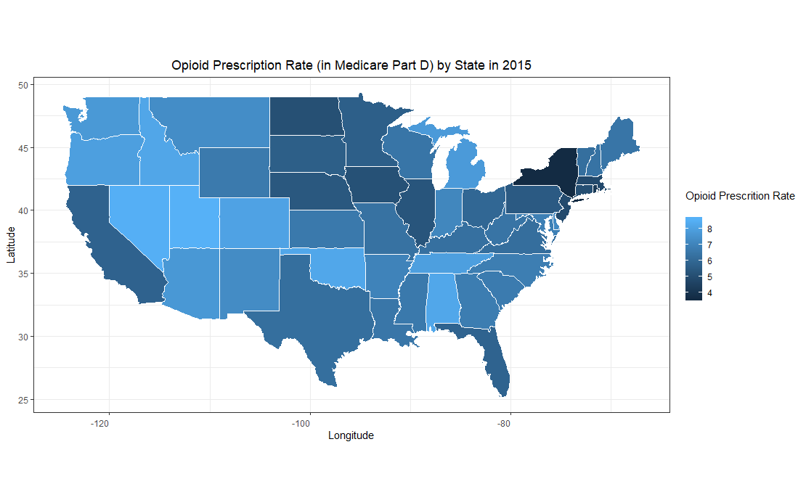
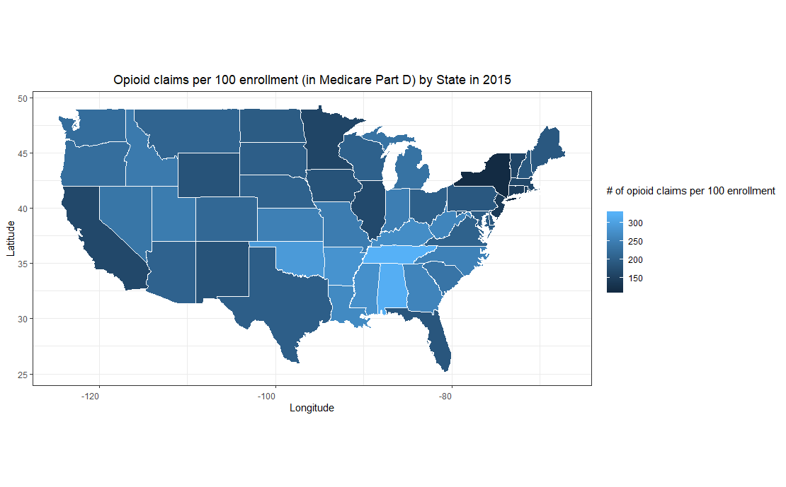

```{r setup, include=FALSE}
knitr::opts_chunk$set(include = TRUE, comment = NA,  
                      message = FALSE, warning = FALSE, echo = TRUE)
```

# Motivation  

Opioid prescription has become a popular topic because of 
the increasing prescription and concerns about overdose, 
opioid-related deaths, and other opioid-associated side 
effects. (Ref: [Paulozzi et al. 2011](https://www.ncbi.nlm.nih.gov/pubmed/22048730), 
[Rudd et al. 2016](https://www.ncbi.nlm.nih.gov/pubmed/28033313), 
[Rudd et al. 2016](https://www.ncbi.nlm.nih.gov/pubmed/26720857),  
[Solomon et al. 2010](https://www.ncbi.nlm.nih.gov/pubmed/21149754), 
[Dunn, et al. 2010](https://www.ncbi.nlm.nih.gov/pubmed/20083827). )  
   
# What is the data?      
Recently, the Centers for Medicare & Medicaid Services (CMS) has 
prepared a public dataset, including information in the part D covering 
calendar years 2013 through 2016, to make our health care system more transparent, 
and to allow citizens to understand the medical expdenditure and relevant health issues. [Medicare part D dataset](https://www.cms.gov/Research-Statistics-Data-and-Systems/Statistics-Trends-and-Reports/Medicare-Provider-Charge-Data/Downloads/Prescriber_Methods.pdf)  

```{r out.width = "95%", echo = FALSE, out.width='90%'}
#knitr::include_graphics("https://aspe.hhs.gov/system/files/images-reports-basic/70441/fig1.jpg")
```

## Medicare data (Part D)
Medicare Part D is prescription drug coverage plan 
run by Center for Medicare & Medicaid Services (CMS). 
[Here's a website describing the information about part D](https://www.medicare.gov/drug-coverage-part-d) 
It was originally proposed by President Bill Clinton in 2000 
based on earlier proposals developed by Congresswoman 
Nancy Pelosi and Senator Tom Daschle, and started in 
January 2006. 
There are two ways for participaints to enroll in Medicare part D: 
(1) Medicare Advantage prescription drug plans (MA-PDs), which comes 
along with other Medicare benefits (ex: Part A or Part B), and 
(2) stand-alone prescription drug plan (PDP). 
That means that for those who have already enrolled in Medicare 
(either >= 65 years old 
or having certain diseases such as end-stage-renal-disease 
or other disabilities), they 
are eligible to join the Part D. 
( [See the Medicare Part A and Part B for more information.](https://www.hhs.gov/answers/medicare-and-medicaid/who-is-elibible-for-medicare/index.html) and [The eligibility for Medicare among those under 65.](https://www.medicareinteractive.org/get-answers/medicare-basics/medicare-eligibility-overview/medicare-eligibility-for-those-under-65) ).
For people enrolled in other insurance plan, they may 
also be eligible to apply for the plan. [Other insurance](https://www.medicare.gov/drug-coverage-part-d/how-part-d-works-with-other-insurance). 


### Opioid information 
```{r}
if(!file.exists("./data/2016prescriber.csv")){
  file_link <- "https://data.cms.gov/api/views/6wg9-kwip/rows.csv"
  download.file(file_link,
                destfile = "./data/2016prescriber.csv",mode = "wb") 
  }


if(!file.exists("./data/2015prescriber.csv")){
  file_link <- "https://data.cms.gov/api/views/6i2k-7h8p/rows.csv"
  download.file(file_link,
                destfile = "./data/2015prescriber.csv",mode = "wb") 
  }

if(!file.exists("./data/2014prescriber.csv")){
  file_link <- "https://data.cms.gov/api/views/e4ka-3ncx/rows.csv"
  download.file(file_link,
                destfile = "./data/2014prescriber.csv",mode = "wb") 
  }

if(!file.exists("./data/2013prescriber.csv")){
  file_link <- "https://data.cms.gov/api/views/yb2j-f3fp/rows.csv"
  download.file(file_link,
                destfile = "./data/2013prescriber.csv",mode = "wb") 
}
```

The files we just downloaded contain the following information: 
```{r}
library(kableExtra)
library(tidyverse)
partdinfodescription = read.csv("./doc2/prescriberopioiddescription.csv")
names(partdinfodescription)[1] <- "Column Name"
partdinfodescription %>%
  select(`Column Name`,Description) %>%
  kable() %>%
  kable_styling()  
```

### Medicare Part D beneficiaries information
The information about Medicare Part D beneficiaries are publicly available. Here, we 
deomonstrate how to download file from the website directly. 
```{r}
if(!file.exists("./data/2016partDprescriberinfo.csv")){
  file_link <- "https://data.cms.gov/api/views/yvpj-pmj2/rows.csv"
  download.file(file_link,
                destfile = "./data/2016partDprescriberinfo.csv",mode = "wb") 
  }

if(!file.exists("./data/2015partDprescriberinfo.csv")){
  file_link <- "https://data.cms.gov/api/views/3z4d-vmhm/rows.csv"
  download.file(file_link,
                destfile = "./data/2015partDprescriberinfo.csv",mode = "wb") 
  }

if(!file.exists("./data/2014partDprescriberinfo.csv")){
  file_link <- "https://data.cms.gov/api/views/465c-49pb/rows.csv"
  download.file(file_link,
                destfile = "./data/2014partDprescriberinfo.csv",mode = "wb") 
  }


if(!file.exists("./data/2013partDprescriberinfo.csv")){
  file_link <- "https://data.cms.gov/api/views/4uvc-gbfz/rows.csv"
  download.file(file_link,
                destfile = "./data/2013partDprescriberinfo.csv",mode = "wb") 
  }

```
The following is the codebook. In other words, 
the description of the variables in the dataset 
we just downloaded is summarized in the following 
table: (Of note, NPI stands for National Provider Identifier, 
and NPPES stands for CMS National Plan and Provider Enumeration System. 
In general, healthcare providers have their unique 
10-dgit NPIs to identify themselves, and more information can be found 
in the [NPI Registry Public Search](https://npiregistry.cms.hhs.gov/))
```{r}
partdinfodescription = read.csv("./doc2/partdinfodescription.csv") 
names(partdinfodescription)[1] <- "Column Name"
partdinfodescription %>%
  select(`Column Name`,Description) %>%
  kable() %>%
  kable_styling()  
```

# Data Import 
```{r}
library(readr)
library(tidyverse)
prescription_2016 <- read_csv("./data/2016prescriber.csv")
prescription_2015 <- read_csv("./data/2015prescriber.csv")
prescription_2014 <- read_csv("./data/2014prescriber.csv")
prescription_2013 <- read_csv("./data/2013prescriber.csv")
```

 
# Data Wrangling 
```{r}
prescription_2016 %>% 
  mutate(NPI = as.character(NPI)) %>% 
  head(.) %>%
  kable() %>%
  kable_styling()
```

## Add State information   

```{r}
unique(prescription_2016$`NPPES Provider State`)
```

There are 61 values for `NPPES Provider State`. 
From the [manual](https://www.cms.gov/Research-Statistics-Data-and-Systems/Statistics-Trends-and-Reports/Medicare-Provider-Charge-Data/Downloads/Prescriber_Methods.pdf), 
we know that other than the fifty States and DC, there are 
the other 10 values as fullowing:

Values for `NPPES Provider State` |  Description  |
--- | --- |
`XX` | Unknown |
`AA` | Armed Forces Central/South America |
`AE` | Armed Forces Europe |
`AP` | Armed Forces Pacific |
`AS` | American Samoa |
`GU` | Guam |
`MP` | Northern Mariana Islands |
`PR` | Puerto Rico |
`VI` | Virgin Islands |
`ZZ` | Foreign Country |

```{r}
library(datasets)
data(state)
unique(state.name) # There are only 50 States
state.abb <- c(state.abb, "DC",
               "XX",
               "AA",
               "AE",
               "AP",
               "AS",
               "GU",
               "MP",
               "PR",
               "VI",
               "ZZ")
state.region <- as.factor(c(as.character(state.region), "South",
                            rep("Others",10)))
state.name <- c(state.name, "District of Columbia",
                "Unknown",
                "Armed Forces Central/South America",
                "Armed Forces Europe",
                "Armed Forces Pacific",
                "American Samoa",
                "Guam",
                "Northern Mariana Islands",
                "Puerto Rico",
                "Virgin Islands",
                "Foreign Country")

states <- unique(prescription_2016$`NPPES Provider State`) %>% data.frame(.)
names(states) <- "NPPES Provider State"
states$state.name <- state.name[match(tolower(states$`NPPES Provider State`), tolower(state.abb))]
states$region <- state.region[match(tolower(states$`NPPES Provider State`), tolower(state.abb))]

states %>%  
  kable() %>%
  kable_styling() 
```

## Add population information for each State  
For us to understand the statistics of opioid usage 
in each State, we may also want to get information 
about how many participants enrolled in the 
Part D plan for each State. Here, we used the publicly 
available information from 
[CMS website](https://www.cms.gov/newsroom/press-releases/its-50th-anniversary-more-55-million-americans-covered-medicare).    
(Note: The information is based on 2015. 
Please let us know if there are year-by-year 
State-level Plan D enrollment information, 
so that we can update this analysis.)
```{r}
population <- read_csv("./doc2/enrollnumber.csv") %>%
                dplyr::rename( state.name = State,
                        enrollmentnum = Total)
```
Now, we can add the number of enrollment in 
Plan D by State from `population` to the 
States information datast `states`.   
Note that there are some difference in the 
names of States between `population` and 
`states`. They are "Pending State Designation" 
and "Foreign and Other Outlying Areas". Thus, 
in the further analysis, we can consider if we 
want to add them in or exclude them. 
```{r}
population$state.name
```

```{r}
populationstate <- states %>% 
                dplyr::left_join(.,population, by = c("state.name"))

populationstate %>%
  head() %>% 
  kable() %>% 
  kable_styling() 
```
Let's take a look at how many States do we have 
the information about number of enrollment in 
Plan D. 
```{r}
sum(!is.na(populationstate$enrollmentnum))  
```


```{r}
sum(is.na(prescription_2016$`Total Claim Count`))
sum(is.na(prescription_2016$`Opioid Claim Count`))
```
Also, we noticed that there are some missing values due in `Opioid Claim Count`. This may be due to some reasons (ex: restricted licence issues, ...). To calculate the 
opioid prescription rate, we need both information. 

```{r}
prescriber2016byState <- prescription_2016 %>% 
             dplyr::left_join(.,populationstate,by = c("NPPES Provider State")) %>%
             dplyr::select(`NPPES Provider State`,
                           state.name,region,
                           `Opioid Claim Count`,
                           `Total Claim Count`,
                           enrollmentnum) %>% 
             dplyr::filter(is.na(`Total Claim Count`) + 
                           is.na(`Opioid Claim Count`) == 0 ) %>%
             dplyr::group_by(`NPPES Provider State`) %>% 
             dplyr::summarise(total.opioid.claim = sum(`Opioid Claim Count`),
                              total.claim.count = sum(`Total Claim Count`)) %>% 
             dplyr::mutate(state.opioid.prescribing.rate = 
                             (total.opioid.claim/total.claim.count)*100) %>%
             dplyr::arrange(desc(state.opioid.prescribing.rate)) %>%
             dplyr::left_join(.,populationstate,by = c("NPPES Provider State")) %>%
             dplyr::mutate(total.claim.bypop = 
                             (total.claim.count/enrollmentnum)*100,
                           opioid.claim.bypop = 
                             (total.opioid.claim/enrollmentnum)*100) %>%
             dplyr::mutate(year = 2016)

```
We can apply same techniques to opioid prescription information in different years: 
```{r}
prescriber2015byState <- prescription_2015 %>% 
             dplyr::left_join(.,populationstate,by = c("NPPES Provider State")) %>%
             dplyr::select(`NPPES Provider State`,
                           state.name,region,
                           `Opioid Claim Count`,
                           `Total Claim Count`,
                           enrollmentnum) %>% 
             dplyr::filter(is.na(`Total Claim Count`) + 
                           is.na(`Opioid Claim Count`) == 0 ) %>%
             dplyr::group_by(`NPPES Provider State`) %>% 
             dplyr::summarise(total.opioid.claim = sum(`Opioid Claim Count`),
                              total.claim.count = sum(`Total Claim Count`)) %>% 
             dplyr::mutate(state.opioid.prescribing.rate = 
                             (total.opioid.claim/total.claim.count)*100) %>%
             dplyr::arrange(desc(state.opioid.prescribing.rate)) %>%
             dplyr::left_join(.,populationstate,by = c("NPPES Provider State")) %>%
             dplyr::mutate(total.claim.bypop = 
                             (total.claim.count/enrollmentnum)*100,
                           opioid.claim.bypop = 
                             (total.opioid.claim/enrollmentnum)*100) %>%
             dplyr::mutate(year = 2015)


prescriber2014byState <- prescription_2014 %>% 
             dplyr::left_join(.,populationstate,by = c("NPPES Provider State")) %>%
             dplyr::select(`NPPES Provider State`,
                           state.name,region,
                           `Opioid Claim Count`,
                           `Total Claim Count`,
                           enrollmentnum) %>% 
             dplyr::filter(is.na(`Total Claim Count`) + 
                           is.na(`Opioid Claim Count`) == 0 ) %>%
             dplyr::group_by(`NPPES Provider State`) %>% 
             dplyr::summarise(total.opioid.claim = sum(`Opioid Claim Count`),
                              total.claim.count = sum(`Total Claim Count`)) %>% 
             dplyr::mutate(state.opioid.prescribing.rate = 
                             (total.opioid.claim/total.claim.count)*100) %>%
             dplyr::arrange(desc(state.opioid.prescribing.rate)) %>%
             dplyr::left_join(.,populationstate,by = c("NPPES Provider State")) %>%
             dplyr::mutate(total.claim.bypop = 
                             (total.claim.count/enrollmentnum)*100,
                           opioid.claim.bypop = 
                             (total.opioid.claim/enrollmentnum)*100) %>%
             dplyr::mutate(year = 2014)


prescriber2013byState <- prescription_2013 %>% 
             dplyr::left_join(.,populationstate,by = c("NPPES Provider State")) %>%
             dplyr::select(`NPPES Provider State`,
                           state.name,region,
                           `Opioid Claim Count`,
                           `Total Claim Count`,
                           enrollmentnum) %>% 
             dplyr::filter(is.na(`Total Claim Count`) + 
                           is.na(`Opioid Claim Count`) == 0 ) %>%
             dplyr::group_by(`NPPES Provider State`) %>% 
             dplyr::summarise(total.opioid.claim = sum(`Opioid Claim Count`),
                              total.claim.count = sum(`Total Claim Count`)) %>% 
             dplyr::mutate(state.opioid.prescribing.rate = 
                             (total.opioid.claim/total.claim.count)*100) %>%
             dplyr::arrange(desc(state.opioid.prescribing.rate)) %>%
             dplyr::left_join(.,populationstate,by = c("NPPES Provider State")) %>%
             dplyr::mutate(total.claim.bypop = 
                             (total.claim.count/enrollmentnum)*100,
                           opioid.claim.bypop = 
                             (total.opioid.claim/enrollmentnum)*100) %>%
             dplyr::mutate(year = 2013)

```


# Data Visualization  
## Trend of opioid prescription rate in 2016 

```{r fig.width=8,fig.height=10}
library(ggplot2)
p <- prescriber2016byState %>% 
                    ggplot(aes(x=reorder(state.name,
                                         -state.opioid.prescribing.rate), 
                               y=state.opioid.prescribing.rate)) + 
                    geom_bar(stat="identity")

p + theme_bw() + 
    theme(plot.title = element_text(hjust = 0.5 ), 
          axis.text.x = element_text(angle = 90, hjust = 1,vjust = 0.5)) + 
    ggtitle("Opioid Prescription Rate (in Medicare Part D) by State in 2016") + 
    xlab("States") + 
    ylab("Opioid Prescription Rate (Number of opioid claims per 100 claims)")   
```
   
## Trend of opioid prescription rate in 2013 - 2016  
We may want to see the trend of opioid prescription rate during 2013 and 2016 by State. 
Here, we append the data from different years in **long format** first, 
and then plot the trend of opioid prescription rate.  
```{r fig.width=12,fig.height=10}
library(ggplot2)


p <- prescriber2016byState %>% 
        dplyr::union(.,prescriber2015byState) %>%
        dplyr::union(.,prescriber2014byState) %>%
        dplyr::union(.,prescriber2013byState) %>%
                    ggplot(aes(x=reorder(state.name,
                                         -state.opioid.prescribing.rate), 
                               y=state.opioid.prescribing.rate,
                               fill = as.factor(year))) + 
                    geom_bar(position = "dodge", stat="identity")

p + theme_bw() + 
    theme(plot.title = element_text(hjust = 0.5 ), 
          axis.text.x = element_text(angle = 90, hjust = 1,vjust = 0.5)) + 
    ggtitle("OTrend of opioid Prescription Rate (in Medicare Part D) by State during 2013 - 2016") + 
    xlab("States") + 
    ylab("Opioid Prescription Rate (Number of opioid claims per 100 claims)")   + 
    labs(fill = "Year")
```

Since there are many policies made at State level, and 
it's relatively difficult to get information about the 
policy in militaries, foreign countries, and unknown areas, 
we may want to focus on the areas we are able to get the 
information about the number of Part D Plan enrollment. 
Thus, we plotted the trend again among those area with 
the number of Part D plan in 2015 available. 

```{r fig.width=12,fig.height=10}
library(ggplot2)

p <- prescriber2016byState %>% 
        dplyr::union(.,prescriber2015byState) %>%
        dplyr::union(.,prescriber2014byState) %>%
        dplyr::union(.,prescriber2013byState) %>%
        dplyr::filter(complete.cases(.)) %>%
                    ggplot(aes(x=reorder(state.name,
                                         -state.opioid.prescribing.rate), 
                               y=state.opioid.prescribing.rate,
                               fill = as.factor(year))) + 
                    geom_bar(position = "dodge", stat="identity")

p + theme_bw() + 
    theme(plot.title = element_text(hjust = 0.5 ), 
          axis.text.x = element_text(angle = 90, hjust = 1,vjust = 0.5)) + 
    ggtitle("Trend of opioid Prescription Rate (in Medicare Part D) by State during 2013 - 2016") + 
    xlab("States") + 
    ylab("Opioid Prescription Rate (Number of opioid claims per 100 claims)")   + 
    labs(fill = "Year")
```

## Total opioid prescription claims (adjusted for number of enrollment) by States in 2015  
We may want to see the trend of opioid prescription per 100 enrollment in 2015. 
```{r fig.width=12,fig.height=10}
library(ggplot2)

p <- prescriber2015byState %>% 
        dplyr::filter(complete.cases(.)) %>%
                    ggplot(aes(x=reorder(state.name,
                                         -opioid.claim.bypop), 
                               y=opioid.claim.bypop)) + 
                    geom_bar(position = "dodge", stat="identity")

p + theme_bw() + 
    theme(plot.title = element_text(hjust = 0.5 ), 
          axis.text.x = element_text(angle = 90, hjust = 1,vjust = 0.5)) + 
    ggtitle("Opioid prescription per 100 enrollments in Medicare Part D\ by State in 2015") + 
    xlab("States") + 
    ylab("Number of opioid prescription claims per 100 enrollments")   + 
    labs(fill = "Year",
         caption = "* Please note that the number of denominator comes from 2015.")
```

## Total claims by States in 2015  
We may want to see the trend of total claims per 100 enrollment in 2015 by State. 
```{r fig.width=12,fig.height=10}
library(ggplot2)

p <- prescriber2015byState %>% 
        dplyr::filter(complete.cases(.)) %>%
                    ggplot(aes(x=reorder(state.name,
                                         -total.claim.bypop), 
                               y=total.claim.bypop)) + 
                    geom_bar(position = "dodge", stat="identity")

p + theme_bw() + 
    theme(plot.title = element_text(hjust = 0.5 ), 
          axis.text.x = element_text(angle = 90, hjust = 1,vjust = 0.5)) + 
    ggtitle("Total claims per 100 enrollments in Medicare Part D by State in 20150") + 
    xlab("States") + 
    ylab("Number of total claims per 100 enrollments")   + 
    labs(fill = "Year",
         caption = "* Please note that the number of denominator comes from 2015.")
```


## Let's mapping it.    
### ggmap 
In order to use ggmap, you need to apply for Google API Key
```{r}
library(ggmap)
```
```{r eval = FALSE}
register_google(key = "YOUR API KEY")
```
```{r}
has_google_key()
```
--> Keep working on Alaska & gradient
```{r fig.width=8,fig.height=10, eval=FALSE}
map <- get_googlemap(center ='united states', zoom=4, maptype = "terrain",
                     color='color')

statesmapinfo <- map_data("state") %>% 
                  rename(state.name = region) 

head(statesmapinfo) %>% kable() %>% kable_styling() 

prescriber2015byState4map <- prescriber2015byState %>% 
                              mutate(state.name = tolower(state.name))

map2015 <- statesmapinfo %>%
                    select(-subregion) %>%
                    left_join(.,prescriber2015byState4map,by = c("state.name") ) 


p <- ggplot(data = map2015) + 
      geom_polygon(aes(x = long, y = lat, 
                       fill = state.opioid.prescribing.rate, group = group), 
                   color = "white") + 
      coord_quickmap() +
      guides(fill = FALSE)


p + theme_bw() + 
    theme(plot.title = element_text(hjust = 0.5 ), 
          axis.text.x = element_text(angle = 0, hjust = 1,vjust = 0.5)) + 
    ggtitle("Opioid Prescription Rate (in Medicare Part D) by State in 2015") + 
    xlab("") + 
    ylab(" ") +
    scale_fill_gradient(breaks = seq(3,9,by = 0.2))


p1 <- ggplot(data = map2015) + 
      geom_polygon(aes(x = long, y = lat, 
                       fill = opioid.claim.bypop, group = group), 
                   color = "white") + 
      coord_quickmap() +
      guides(fill = FALSE)


p1+ theme_bw() + 
    theme(plot.title = element_text(hjust = 0.5 ), 
          axis.text.x = element_text(angle = 0, hjust = 1,vjust = 0.5)) + 
    ggtitle("Opioid claims per 100 enrollment (in Medicare Part D) by State in 2015") + 
    xlab("") + 
    ylab(" ") +
    scale_fill_gradient(breaks = seq(100,340,by = 10))
```

```{r echo=FALSE, out.width='100%'}

```

```{r echo=FALSE, out.width='100%'}

```

# Summary   
To be continued
